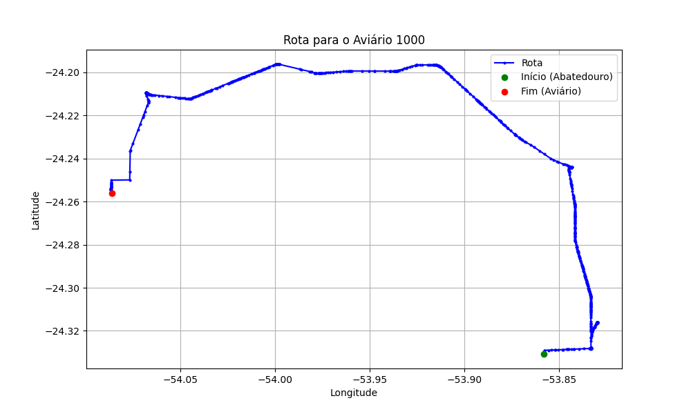

# Relatório de Rota - Aviário 1000

## Informações Gerais
- **Produtor:** ALENCAR JOSE MOREIRA
- **Latitude:** -24.25625
- **Longitude:** -54.085389

## Dados da Rota
- **Distância Real:** 45.06 km
- **Tempo Estimado (OSRM):** 50.7 minutos
- **Tempo Estimado (40 km/h):** 67.6 minutos

## Mapa da Rota

[Visualizar Mapa Interativo](mapa_interativo.html)

## Rota até o aviário
1. Saia da rua sem nome, siga por 10m.
2. Vire à direita na Avenida Ariosvaldo Bitencourt, siga por 200m.
3. Siga em frente na Avenida Ariosvaldo Bitencourt, siga por 2,5 km.
4. Vire à esquerda na rua sem nome, siga por 1,5 km.
5. Vire levemente à esquerda na rua sem nome, siga por 660m.
6. Vire em frente na Rodovia Alberto Dalcanale, siga por 1,7 km.
7. New name em frente na Avenida Presidente Kennedy, siga por 7,2 km.
8. Fork levemente à esquerda na rua sem nome, siga por 2,9 km.
9. New name em frente na rua sem nome, siga por 22,1 km.
10. Vire à esquerda na rua sem nome, siga por 4,7 km.
11. Vire à direita na rua sem nome, siga por 1000m.
12. Vire à esquerda na rua sem nome, siga por 530m.
13. New name em frente na rua sem nome, siga por 170m.
14. Você chegará ao aviário 1000 à esquerda.
