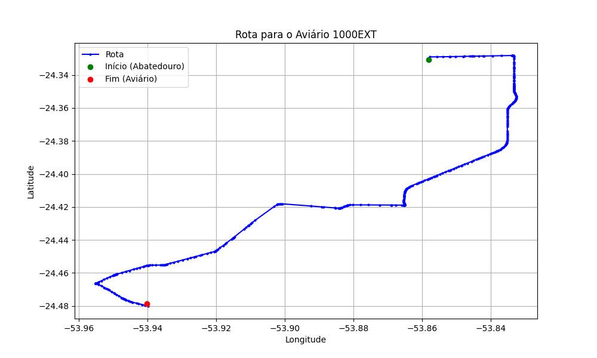

# Relatório de Rota - Aviário 1000EXT

## Informações Gerais
- **Produtor:** PLUMA TIAGO LUIS ZERETZKI 02
- **Latitude:** -24.478697
- **Longitude:** -53.93998

## Dados da Rota
- **Distância Real:** 28.13 km
- **Tempo Estimado (OSRM):** 29.3 minutos
- **Tempo Estimado (40 km/h):** 42.2 minutos

## Mapa da Rota

