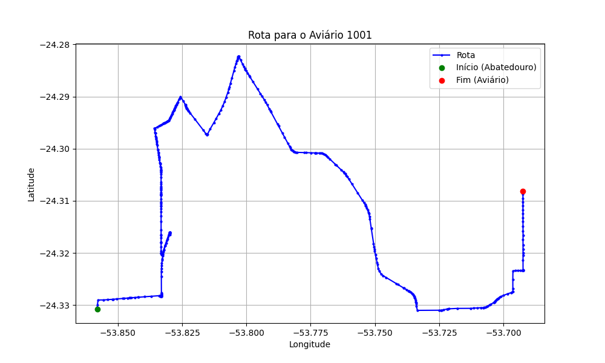

# Relatório de Rota - Aviário 1001

## Informações Gerais
- **Produtor:** INAIARA CALCAGNO RODRIGUES BUTTINI
- **Latitude:** -24.308143
- **Longitude:** -53.691167

## Dados da Rota
- **Distância Real:** 28.08 km
- **Tempo Estimado (OSRM):** 37.6 minutos
- **Tempo Estimado (40 km/h):** 42.1 minutos

## Mapa da Rota

