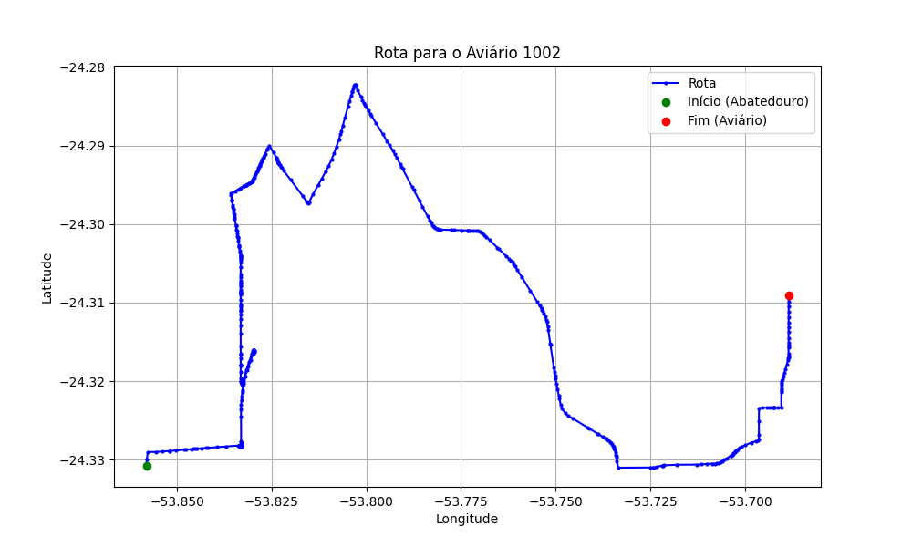

# Relatório de Rota - Aviário 1002

## Informações Gerais
- **Produtor:** MAYKON GENESIO BUTTINI
- **Latitude:** -24.309055
- **Longitude:** -53.689242

## Dados da Rota
- **Distância Real:** 28.23 km
- **Tempo Estimado (OSRM):** 37.9 minutos
- **Tempo Estimado (40 km/h):** 42.3 minutos

## Mapa da Rota

