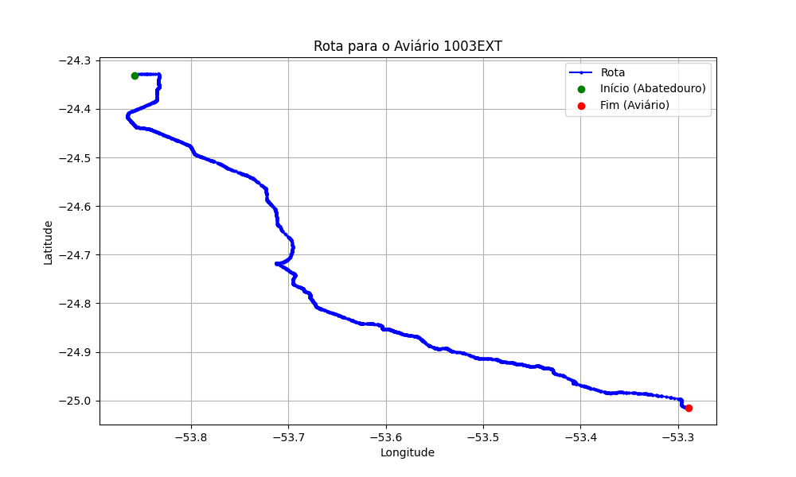

# Relatório de Rota - Aviário 1003EXT

## Informações Gerais
- **Produtor:** PLUMA FUNDACAO PARA O DESENVOLVIMENTO 01
- **Latitude:** -25.013445
- **Longitude:** -53.288749

## Dados da Rota
- **Distância Real:** 114.90 km
- **Tempo Estimado (OSRM):** 95.7 minutos
- **Tempo Estimado (40 km/h):** 172.3 minutos

## Mapa da Rota

