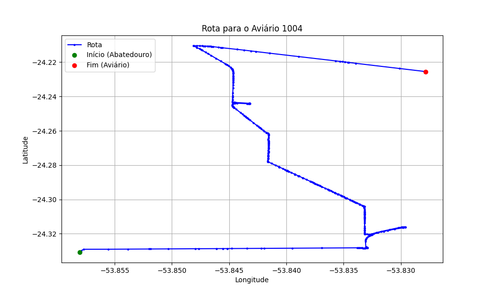

# Relatório de Rota - Aviário 1004

## Informações Gerais
- **Produtor:** CARLOS EMILIO FREITAG
- **Latitude:** -24.228556
- **Longitude:** -53.830778

## Dados da Rota
- **Distância Real:** 20.08 km
- **Tempo Estimado (OSRM):** 24.8 minutos
- **Tempo Estimado (40 km/h):** 30.1 minutos

## Mapa da Rota

