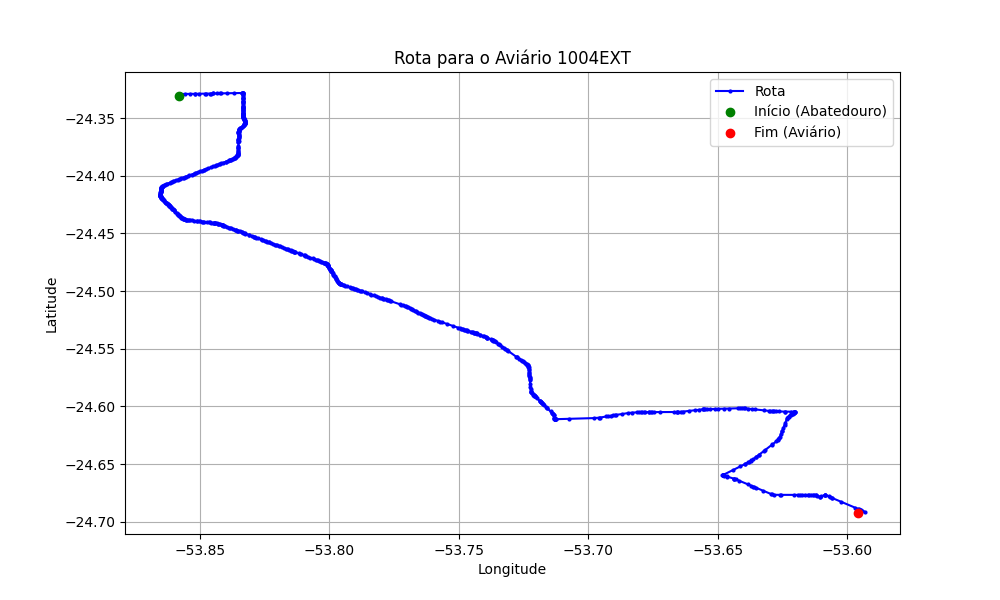

# Relatório de Rota - Aviário 1004EXT

## Informações Gerais
- **Produtor:** PLUMA NERIO LUIS CONRAT 01
- **Latitude:** -24.6935
- **Longitude:** -53.595778

## Dados da Rota
- **Distância Real:** 65.51 km
- **Tempo Estimado (OSRM):** 65.8 minutos
- **Tempo Estimado (40 km/h):** 98.3 minutos

## Mapa da Rota

