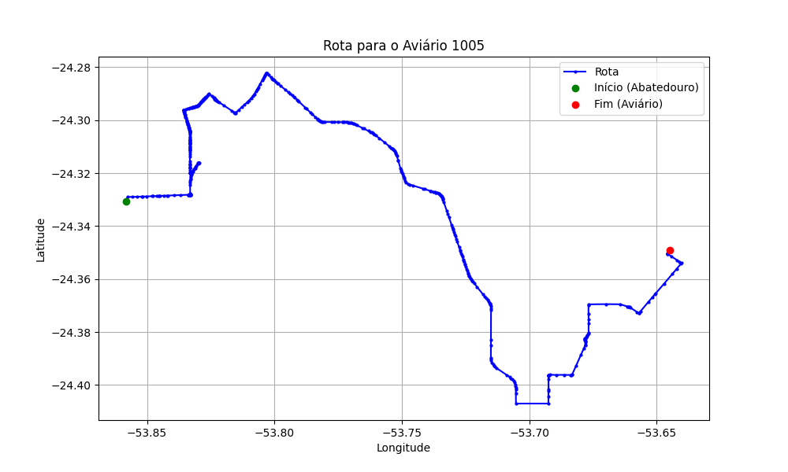

# Relatório de Rota - Aviário 1005

## Informações Gerais
- **Produtor:** MARINES DE FATIMA FAVARO DOS SANTOS
- **Latitude:** -24.34944
- **Longitude:** -53.644222

## Dados da Rota
- **Distância Real:** 43.19 km
- **Tempo Estimado (OSRM):** 59.6 minutos
- **Tempo Estimado (40 km/h):** 64.8 minutos

## Mapa da Rota

