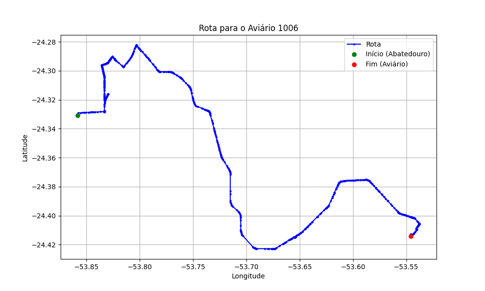

# Relatório de Rota - Aviário 1006

## Informações Gerais
- **Produtor:** ROSALVO MARTINS DE SOUZA
- **Latitude:** -24.414083
- **Longitude:** -53.545939

## Dados da Rota
- **Distância Real:** 53.74 km
- **Tempo Estimado (OSRM):** 58.9 minutos
- **Tempo Estimado (40 km/h):** 80.6 minutos

## Mapa da Rota

