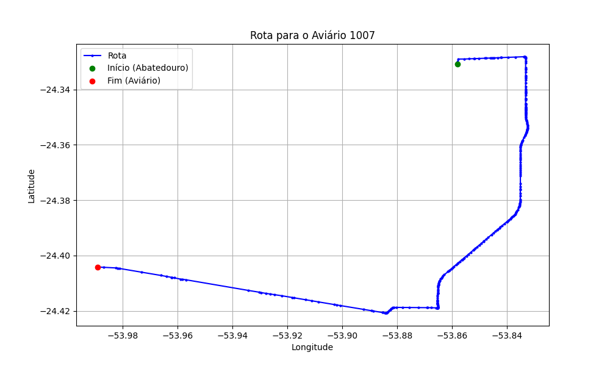

# Relatório de Rota - Aviário 1007

## Informações Gerais
- **Produtor:** HUBERT VITOR RICHTER
- **Latitude:** -24.402622
- **Longitude:** -53.988969

## Dados da Rota
- **Distância Real:** 26.84 km
- **Tempo Estimado (OSRM):** 26.6 minutos
- **Tempo Estimado (40 km/h):** 40.3 minutos

## Mapa da Rota

