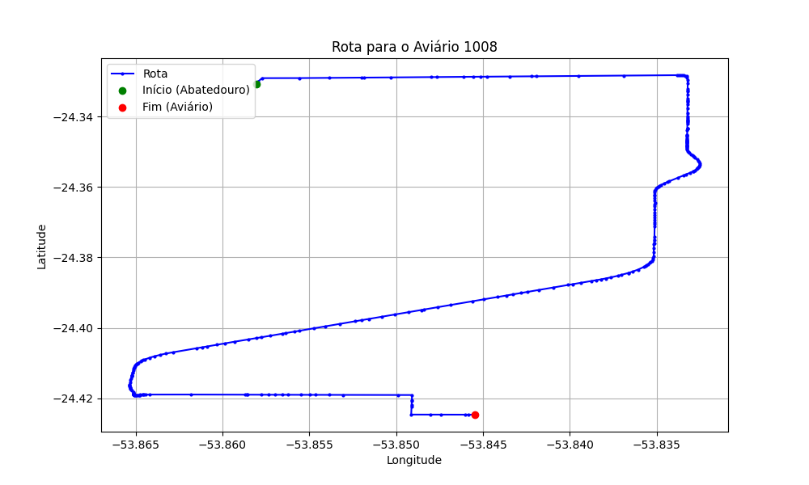

# Relatório de Rota - Aviário 1008

## Informações Gerais
- **Produtor:** RICARDO MULLER
- **Latitude:** -24.425
- **Longitude:** -53.845472

## Dados da Rota
- **Distância Real:** 16.66 km
- **Tempo Estimado (OSRM):** 18.9 minutos
- **Tempo Estimado (40 km/h):** 25.0 minutos

## Mapa da Rota

