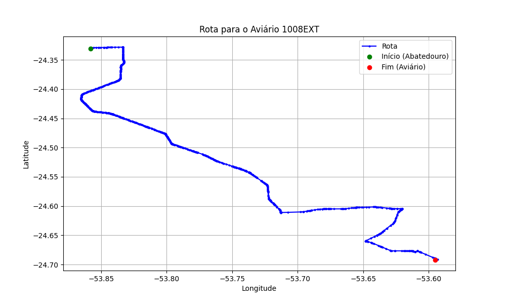

# Relatório de Rota - Aviário 1008EXT

## Informações Gerais
- **Produtor:** PLUMA LAUDELINO CONRAT 01
- **Latitude:** -24.692454
- **Longitude:** -53.595057

## Dados da Rota
- **Distância Real:** 65.44 km
- **Tempo Estimado (OSRM):** 65.6 minutos
- **Tempo Estimado (40 km/h):** 98.2 minutos

## Mapa da Rota

[Visualizar Mapa Interativo](mapa_interativo.html)

## Rota até o aviário
1. Saia da rua sem nome, siga por 10m.
2. Vire à direita na Avenida Ariosvaldo Bitencourt, siga por 200m.
3. Siga em frente na Avenida Ariosvaldo Bitencourt, siga por 2,6 km.
4. Vire em frente na Rodovia Alberto Dalcanale, siga por 38,7 km.
5. Vire levemente à esquerda na rua sem nome, siga por 130m.
6. Vire à esquerda na rua sem nome, siga por 9,5 km.
7. Vire levemente à direita na rua sem nome, siga por 50m.
8. Vire em frente na Rodovia Deputado Moacir Micheletto, siga por 6,8 km.
9. Vire à esquerda na Estrada para Ouro Preto, siga por 4,4 km.
10. Vire à direita na rua sem nome, siga por 250m.
11. Vire à esquerda na rua sem nome, siga por 1,2 km.
12. New name em frente na rua sem nome, siga por 1,3 km.
13. Vire à direita na rua sem nome, siga por 220m.
14. Você chegará ao aviário 1008EXT à esquerda.
