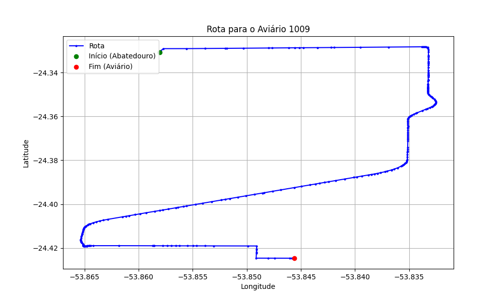

# Relatório de Rota - Aviário 1009

## Informações Gerais
- **Produtor:** RICARDO MULLER
- **Latitude:** -24.42475
- **Longitude:** -53.845583

## Dados da Rota
- **Distância Real:** 16.65 km
- **Tempo Estimado (OSRM):** 18.8 minutos
- **Tempo Estimado (40 km/h):** 25.0 minutos

## Mapa da Rota

[Visualizar Mapa Interativo](mapa_interativo.html)

## Rota até o aviário
1. Saia da rua sem nome, siga por 10m.
2. Vire à direita na Avenida Ariosvaldo Bitencourt, siga por 200m.
3. Siga em frente na Avenida Ariosvaldo Bitencourt, siga por 2,6 km.
4. Vire em frente na Rodovia Alberto Dalcanale, siga por 11,1 km.
5. Siga em frente na rua sem nome, siga por 120m.
6. Vire levemente à direita na rua sem nome, siga por 1,6 km.
7. Vire à direita na rua sem nome, siga por 620m.
8. Vire à esquerda na rua sem nome, siga por 360m.
9. Você chegará ao aviário 1009 à direita.
