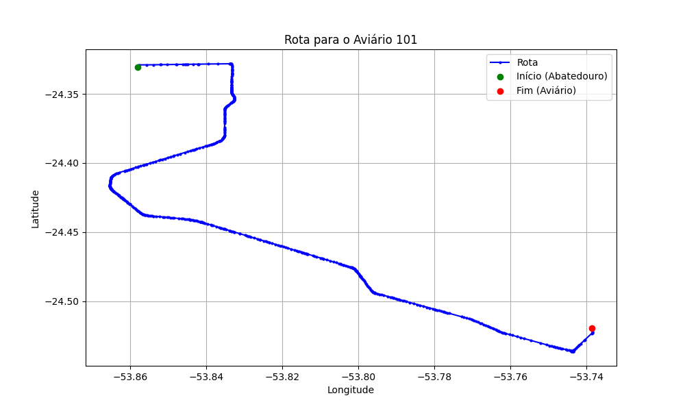

# Relatório de Rota - Aviário 101

## Informações Gerais
- **Produtor:** JOSE ELIAS PANDINI
- **Latitude:** -24.519303
- **Longitude:** -53.735319

## Dados da Rota
- **Distância Real:** 34.54 km
- **Tempo Estimado (OSRM):** 33.6 minutos
- **Tempo Estimado (40 km/h):** 51.8 minutos

## Mapa da Rota

[Visualizar Mapa Interativo](mapa_interativo.html)

## Rota até o aviário
1. Saia da rua sem nome, siga por 10m.
2. Vire à direita na Avenida Ariosvaldo Bitencourt, siga por 200m.
3. Siga em frente na Avenida Ariosvaldo Bitencourt, siga por 2,6 km.
4. Vire em frente na Rodovia Alberto Dalcanale, siga por 29,6 km.
5. Vire levemente à direita na rua sem nome, siga por 160m.
6. Fork levemente à direita na Rua Padre Anchieta, siga por 900m.
7. New name em frente na rua sem nome, siga por 1,0 km.
8. Você chegará ao aviário 101.
