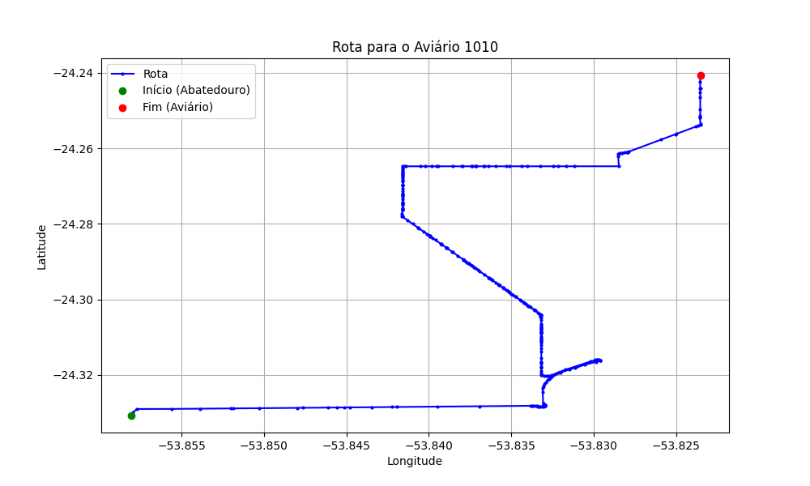

# Relatório de Rota - Aviário 1010

## Informações Gerais
- **Produtor:** ANDERSON ROGERIO DALASTRA
- **Latitude:** -24.240718
- **Longitude:** -53.818679

## Dados da Rota
- **Distância Real:** 15.20 km
- **Tempo Estimado (OSRM):** 28.2 minutos
- **Tempo Estimado (40 km/h):** 22.8 minutos

## Mapa da Rota

