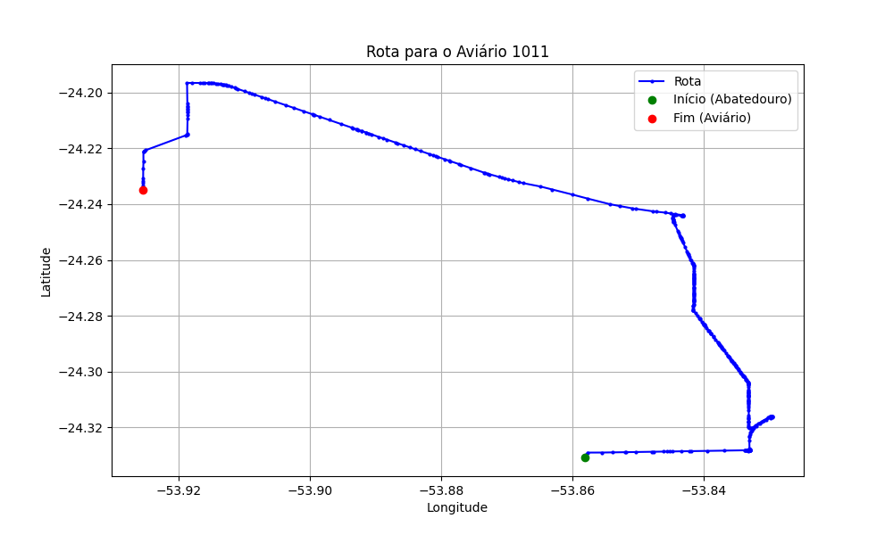

# Relatório de Rota - Aviário 1011

## Informações Gerais
- **Produtor:** LEA ERNA HORN
- **Latitude:** -24.235
- **Longitude:** -53.926139

## Dados da Rota
- **Distância Real:** 27.54 km
- **Tempo Estimado (OSRM):** 80.8 minutos
- **Tempo Estimado (40 km/h):** 41.3 minutos

## Mapa da Rota

