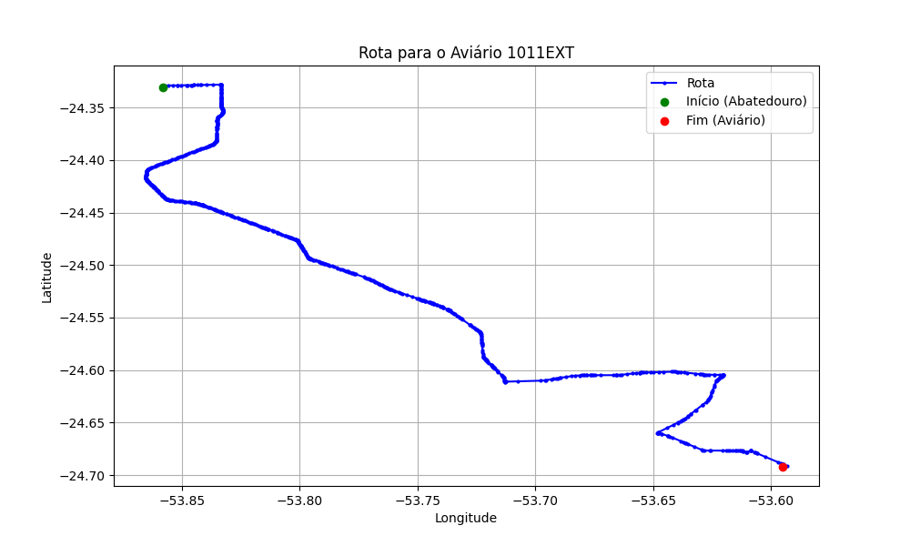

# Relatório de Rota - Aviário 1011EXT

## Informações Gerais
- **Produtor:** PLUMA LAUDELINO CONRAT 04
- **Latitude:** -24.692454
- **Longitude:** -53.595057

## Dados da Rota
- **Distância Real:** 65.44 km
- **Tempo Estimado (OSRM):** 65.6 minutos
- **Tempo Estimado (40 km/h):** 98.2 minutos

## Mapa da Rota

