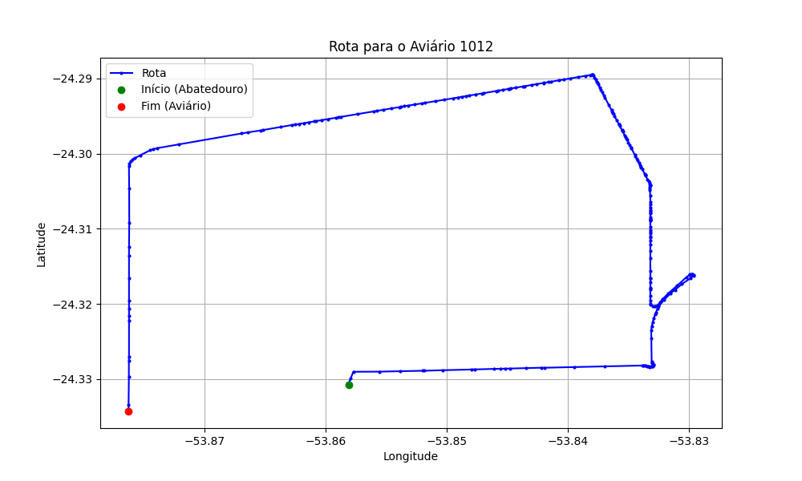

# Relatório de Rota - Aviário 1012

## Informações Gerais
- **Produtor:** NEURI BENETTI
- **Latitude:** -24.334278
- **Longitude:** -53.874889

## Dados da Rota
- **Distância Real:** 16.06 km
- **Tempo Estimado (OSRM):** 23.8 minutos
- **Tempo Estimado (40 km/h):** 24.1 minutos

## Mapa da Rota

