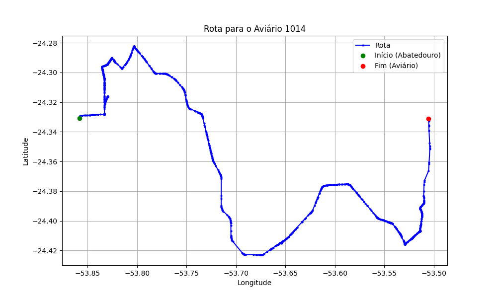

# Relatório de Rota - Aviário 1014

## Informações Gerais
- **Produtor:** FERNANDO ALBERTO SANTIN PORTELA
- **Latitude:** -24.331089
- **Longitude:** -53.505744

## Dados da Rota
- **Distância Real:** 64.37 km
- **Tempo Estimado (OSRM):** 70.1 minutos
- **Tempo Estimado (40 km/h):** 96.6 minutos

## Mapa da Rota

