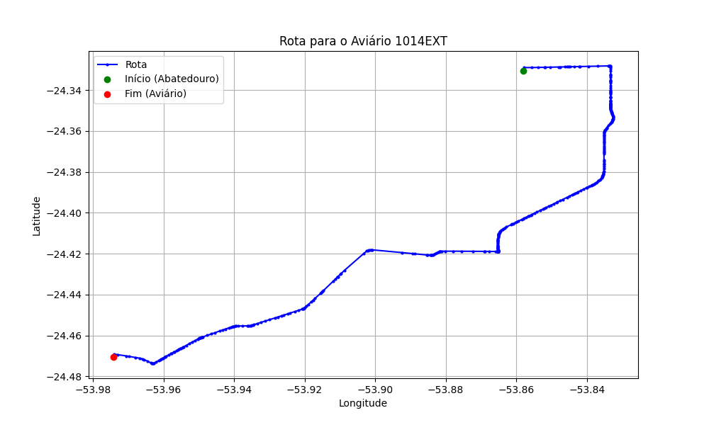

# Relatório de Rota - Aviário 1014EXT

## Informações Gerais
- **Produtor:** PLUMA TELMO EDGAR ENGLERT 03
- **Latitude:** -24.470467
- **Longitude:** -53.974347

## Dados da Rota
- **Distância Real:** 28.31 km
- **Tempo Estimado (OSRM):** 29.1 minutos
- **Tempo Estimado (40 km/h):** 42.5 minutos

## Mapa da Rota

