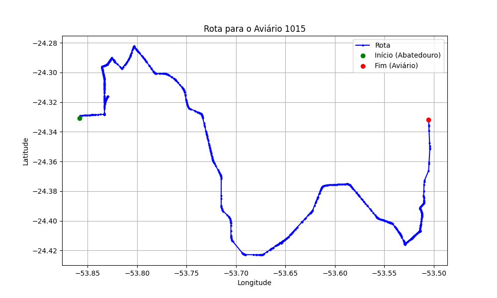

# Relatório de Rota - Aviário 1015

## Informações Gerais
- **Produtor:** MAURO GUERRA
- **Latitude:** -24.331667
- **Longitude:** -53.505222

## Dados da Rota
- **Distância Real:** 64.30 km
- **Tempo Estimado (OSRM):** 70.0 minutos
- **Tempo Estimado (40 km/h):** 96.5 minutos

## Mapa da Rota

