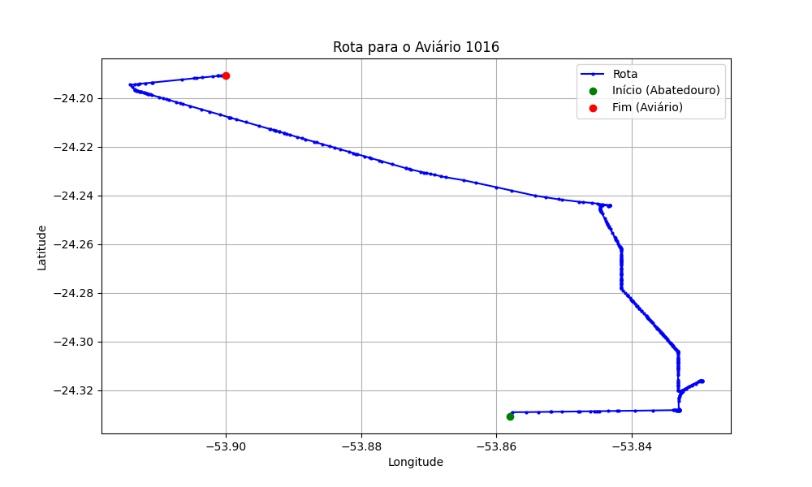

# Relatório de Rota - Aviário 1016

## Informações Gerais
- **Produtor:** TATIANE JUSSARA FRITSCH BOMBACINI
- **Latitude:** -24.188947
- **Longitude:** -53.89892

## Dados da Rota
- **Distância Real:** 24.24 km
- **Tempo Estimado (OSRM):** 28.8 minutos
- **Tempo Estimado (40 km/h):** 36.4 minutos

## Mapa da Rota

