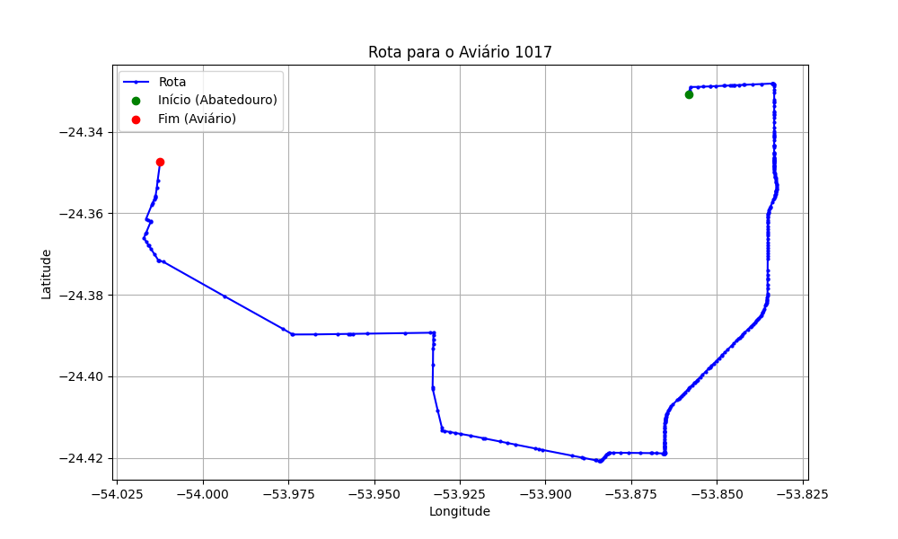

# Relatório de Rota - Aviário 1017

## Informações Gerais
- **Produtor:** EDEGAR OTTO WUTZKE
- **Latitude:** -24.34719
- **Longitude:** -54.013055

## Dados da Rota
- **Distância Real:** 35.11 km
- **Tempo Estimado (OSRM):** 40.5 minutos
- **Tempo Estimado (40 km/h):** 52.7 minutos

## Mapa da Rota

