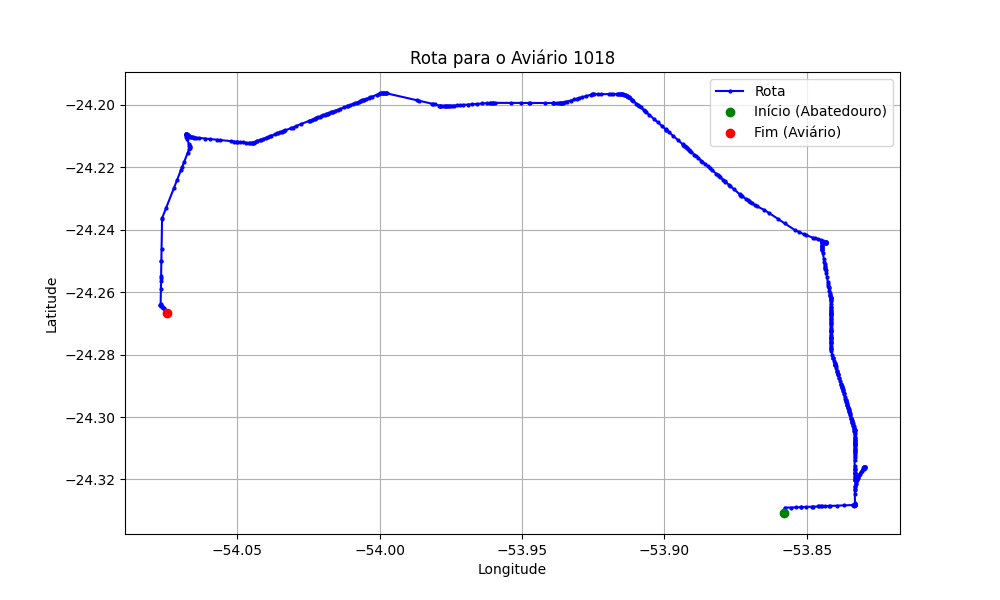

# Relatório de Rota - Aviário 1018

## Informações Gerais
- **Produtor:** KOUGI TAKAHASI
- **Latitude:** -24.267832
- **Longitude:** -54.077054

## Dados da Rota
- **Distância Real:** 45.30 km
- **Tempo Estimado (OSRM):** 49.7 minutos
- **Tempo Estimado (40 km/h):** 67.9 minutos

## Mapa da Rota

