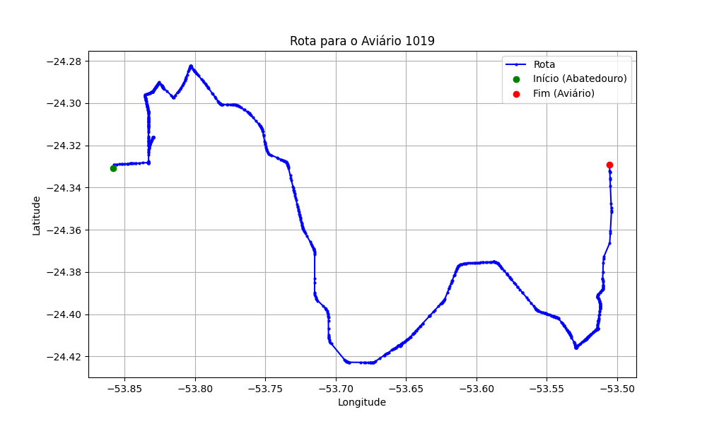

# Relatório de Rota - Aviário 1019

## Informações Gerais
- **Produtor:** MARCOS SANDRO CAMPOS
- **Latitude:** -24.329184
- **Longitude:** -53.506377

## Dados da Rota
- **Distância Real:** 64.58 km
- **Tempo Estimado (OSRM):** 70.4 minutos
- **Tempo Estimado (40 km/h):** 96.9 minutos

## Mapa da Rota

