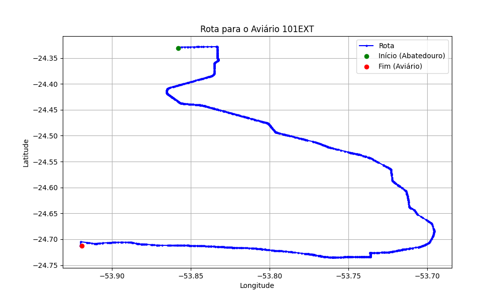

# Relatório de Rota - Aviário 101EXT

## Informações Gerais
- **Produtor:** PLUMA ADILSON LUIZ SCHMIDT2
- **Latitude:** -24.712685
- **Longitude:** -53.918949

## Dados da Rota
- **Distância Real:** 78.34 km
- **Tempo Estimado (OSRM):** 77.9 minutos
- **Tempo Estimado (40 km/h):** 117.5 minutos

## Mapa da Rota

