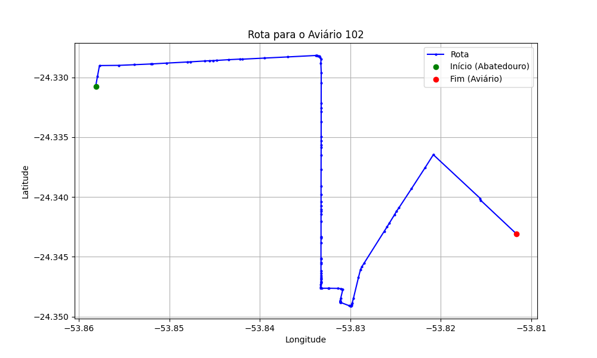

# Relatório de Rota - Aviário 102

## Informações Gerais
- **Produtor:** PAULO CEZAR HOFFMANN
- **Latitude:** -24.351361
- **Longitude:** -53.814306

## Dados da Rota
- **Distância Real:** 8.21 km
- **Tempo Estimado (OSRM):** 14.7 minutos
- **Tempo Estimado (40 km/h):** 12.3 minutos

## Mapa da Rota

