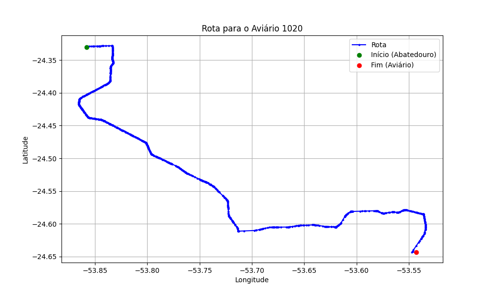

# Relatório de Rota - Aviário 1020

## Informações Gerais
- **Produtor:** SIRLEI FIORI
- **Latitude:** -24.643423
- **Longitude:** -53.54289

## Dados da Rota
- **Distância Real:** 68.99 km
- **Tempo Estimado (OSRM):** 69.5 minutos
- **Tempo Estimado (40 km/h):** 103.5 minutos

## Mapa da Rota

