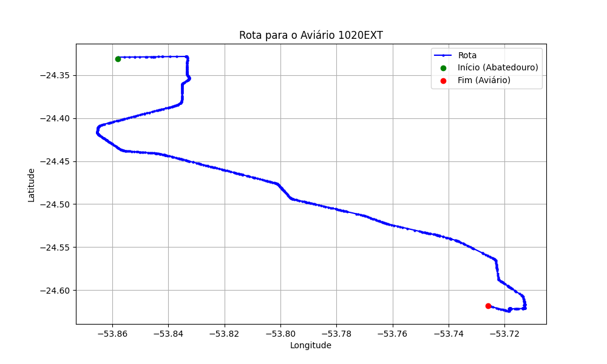

# Relatório de Rota - Aviário 1020EXT

## Informações Gerais
- **Produtor:** PLUMA ROBERTO STOCKMANN 06
- **Latitude:** -24.617927
- **Longitude:** -53.725539

## Dados da Rota
- **Distância Real:** 44.87 km
- **Tempo Estimado (OSRM):** 42.4 minutos
- **Tempo Estimado (40 km/h):** 67.3 minutos

## Mapa da Rota

[Visualizar Mapa Interativo](mapa_interativo.html)

## Rota até o aviário
1. Saia da rua sem nome, siga por 10m.
2. Vire à direita na Avenida Ariosvaldo Bitencourt, siga por 200m.
3. Siga em frente na Avenida Ariosvaldo Bitencourt, siga por 2,6 km.
4. Vire em frente na Rodovia Alberto Dalcanale, siga por 39,2 km.
5. Vire em frente na rua sem nome, siga por 300m.
6. Vire à direita na Rua dos Flamboyants, siga por 460m.
7. Roundabout à direita na Boulevard Peter Drucker Leste, siga por 120m.
8. Exit roundabout acentuadamente à direita na Boulevard Peter Drucker Leste, siga por 520m.
9. New name em frente na Boulevard Peter Drucker Oeste, siga por 120m.
10. Vire à direita na Rua das Magnólias, siga por 290m.
11. End of road à direita na Rua das Carobas, siga por 600m.
12. New name em frente na Rua G22, siga por 440m.
13. Você chegará ao aviário 1020EXT à direita.
