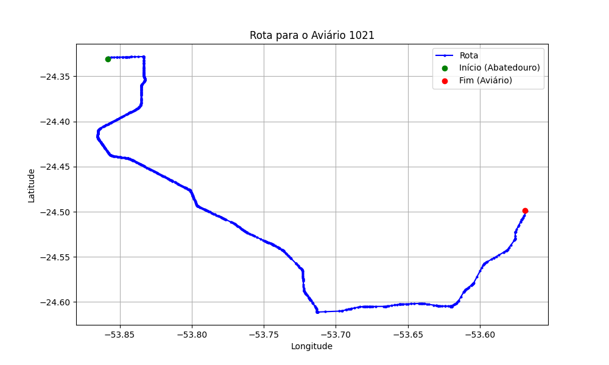

# Relatório de Rota - Aviário 1021

## Informações Gerais
- **Produtor:** MARCELO CESAR BRUGNARI
- **Latitude:** -24.498964
- **Longitude:** -53.5689

## Dados da Rota
- **Distância Real:** 64.61 km
- **Tempo Estimado (OSRM):** 56.9 minutos
- **Tempo Estimado (40 km/h):** 96.9 minutos

## Mapa da Rota

