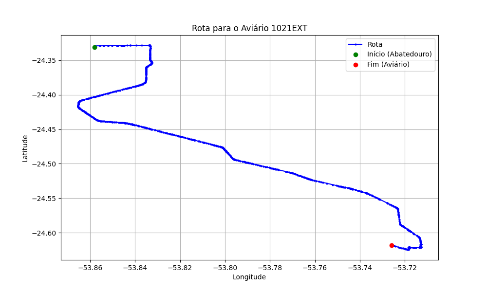

# Relatório de Rota - Aviário 1021EXT

## Informações Gerais
- **Produtor:** PLUMA ROBERTO STOCKMANN 07
- **Latitude:** -24.617927
- **Longitude:** -53.725539

## Dados da Rota
- **Distância Real:** 44.87 km
- **Tempo Estimado (OSRM):** 42.4 minutos
- **Tempo Estimado (40 km/h):** 67.3 minutos

## Mapa da Rota

