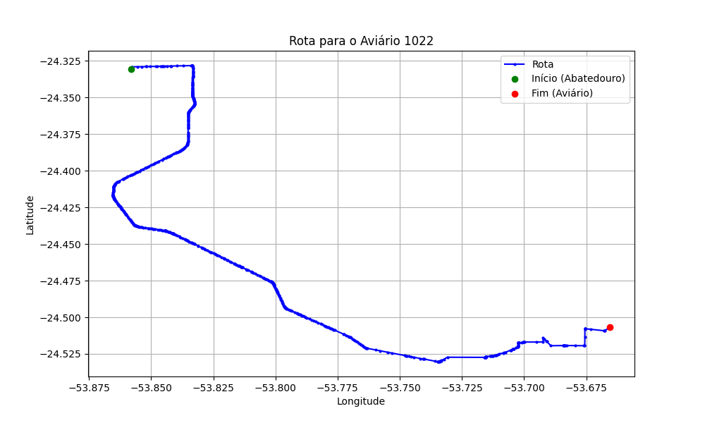

# Relatório de Rota - Aviário 1022

## Informações Gerais
- **Produtor:** EDIMAR DOS SANTOS
- **Latitude:** -24.507535
- **Longitude:** -53.664089

## Dados da Rota
- **Distância Real:** 42.82 km
- **Tempo Estimado (OSRM):** 55.4 minutos
- **Tempo Estimado (40 km/h):** 64.2 minutos

## Mapa da Rota

