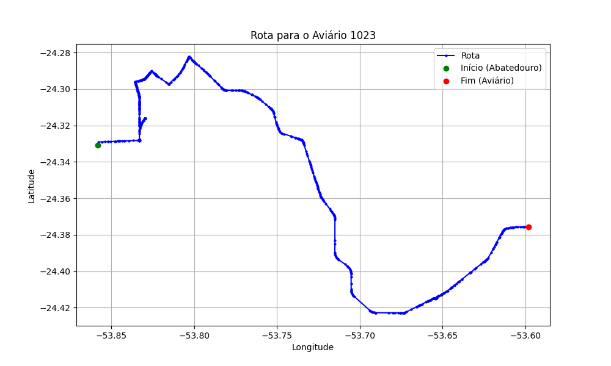

# Relatório de Rota - Aviário 1023

## Informações Gerais
- **Produtor:** ONOFRE APARECIDO FIGUEIRA DIAS
- **Latitude:** -24.376101
- **Longitude:** -53.598163

## Dados da Rota
- **Distância Real:** 44.94 km
- **Tempo Estimado (OSRM):** 47.7 minutos
- **Tempo Estimado (40 km/h):** 67.4 minutos

## Mapa da Rota

