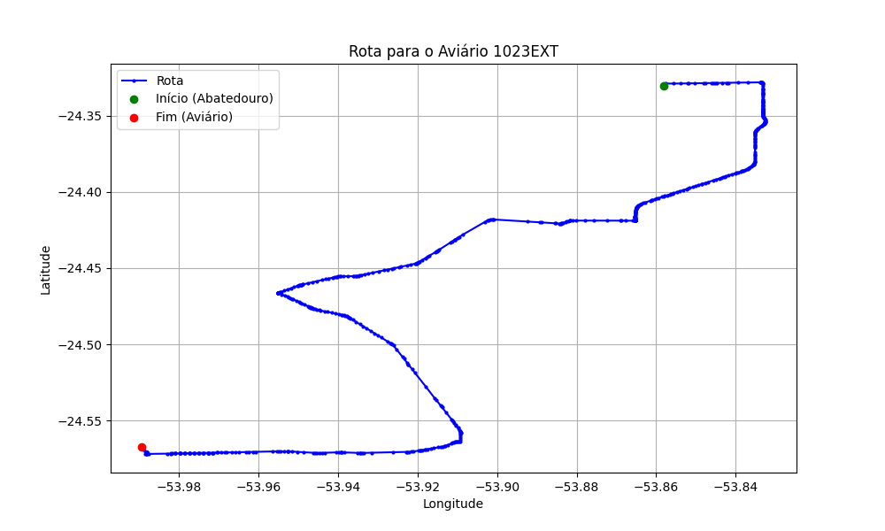

# Relatório de Rota - Aviário 1023EXT

## Informações Gerais
- **Produtor:** PLUMA NADINE CAETANO DO CARMO BACH 01
- **Latitude:** -24.567139
- **Longitude:** -53.989369

## Dados da Rota
- **Distância Real:** 46.71 km
- **Tempo Estimado (OSRM):** 48.5 minutos
- **Tempo Estimado (40 km/h):** 70.1 minutos

## Mapa da Rota

