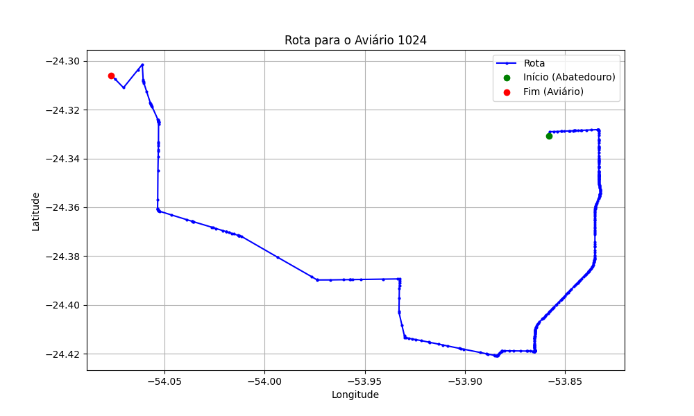

# Relatório de Rota - Aviário 1024

## Informações Gerais
- **Produtor:** ROBERTO MINORU YASUE
- **Latitude:** -24.305136
- **Longitude:** -54.075663

## Dados da Rota
- **Distância Real:** 45.36 km
- **Tempo Estimado (OSRM):** 49.8 minutos
- **Tempo Estimado (40 km/h):** 68.0 minutos

## Mapa da Rota

