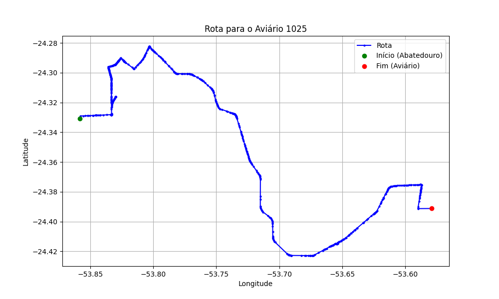

# Relatório de Rota - Aviário 1025

## Informações Gerais
- **Produtor:** ANDREIA JOSE ORLANDO DA SILVA
- **Latitude:** -24.390488
- **Longitude:** -53.579238

## Dados da Rota
- **Distância Real:** 48.97 km
- **Tempo Estimado (OSRM):** 55.9 minutos
- **Tempo Estimado (40 km/h):** 73.5 minutos

## Mapa da Rota

