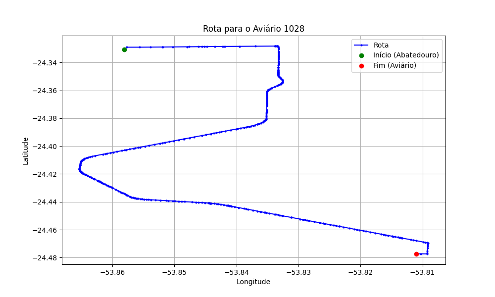

# Relatório de Rota - Aviário 1028

## Informações Gerais
- **Produtor:** LEONARDO DE CASTRO SODRE
- **Latitude:** -24.477157
- **Longitude:** -53.81099

## Dados da Rota
- **Distância Real:** 23.37 km
- **Tempo Estimado (OSRM):** 23.8 minutos
- **Tempo Estimado (40 km/h):** 35.1 minutos

## Mapa da Rota

[Visualizar Mapa Interativo](mapa_interativo.html)

## Rota até o aviário
1. Saia da rua sem nome, siga por 10m.
2. Vire à direita na Avenida Ariosvaldo Bitencourt, siga por 200m.
3. Siga em frente na Avenida Ariosvaldo Bitencourt, siga por 2,6 km.
4. Vire em frente na Rodovia Alberto Dalcanale, siga por 19,5 km.
5. Vire à direita na rua sem nome, siga por 880m.
6. Vire à direita na rua sem nome, siga por 170m.
7. Você chegará ao aviário 1028 à direita.
