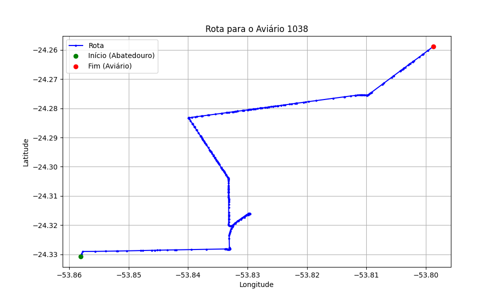

# Relatório de Rota - Aviário 1038

## Informações Gerais
- **Produtor:** RONISE REGINA IORIS CHIODINI
- **Latitude:** -24.258991
- **Longitude:** -53.798491

## Dados da Rota
- **Distância Real:** 14.34 km
- **Tempo Estimado (OSRM):** 19.5 minutos
- **Tempo Estimado (40 km/h):** 21.5 minutos

## Mapa da Rota

[Visualizar Mapa Interativo](mapa_interativo.html)

## Rota até o aviário
1. Saia da rua sem nome, siga por 10m.
2. Vire à direita na Avenida Ariosvaldo Bitencourt, siga por 200m.
3. Siga em frente na Avenida Ariosvaldo Bitencourt, siga por 2,5 km.
4. Vire à esquerda na rua sem nome, siga por 1,5 km.
5. Vire levemente à esquerda na rua sem nome, siga por 660m.
6. Vire em frente na Rodovia Alberto Dalcanale, siga por 1,7 km.
7. New name em frente na Avenida Presidente Kennedy, siga por 2,4 km.
8. Vire à direita na Avenida Independência, siga por 1,8 km.
9. New name em frente na Rodovia Deputado Edilson Alencar, siga por 1,3 km.
10. Vire à esquerda na Linha La Salle, siga por 2,2 km.
11. Você chegará ao aviário 1038 à direita.
