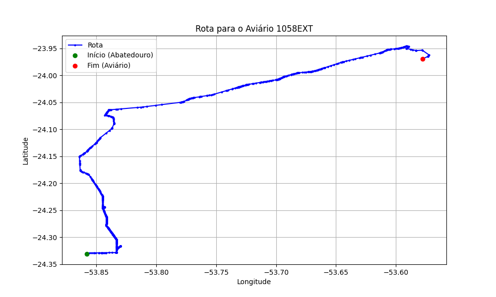

# Relatório de Rota - Aviário 1058EXT

## Informações Gerais
- **Produtor:** PLUSVAL VALMIR DO NASCIMENTO 3
- **Latitude:** -23.969927
- **Longitude:** -53.576602

## Dados da Rota
- **Distância Real:** 68.37 km
- **Tempo Estimado (OSRM):** 69.5 minutos
- **Tempo Estimado (40 km/h):** 102.6 minutos

## Mapa da Rota

[Visualizar Mapa Interativo](mapa_interativo.html)

## Rota até o aviário
1. Saia da rua sem nome, siga por 10m.
2. Vire à direita na Avenida Ariosvaldo Bitencourt, siga por 200m.
3. Siga em frente na Avenida Ariosvaldo Bitencourt, siga por 2,5 km.
4. Vire à esquerda na rua sem nome, siga por 1,5 km.
5. Vire levemente à esquerda na rua sem nome, siga por 660m.
6. Vire em frente na Rodovia Alberto Dalcanale, siga por 1,7 km.
7. New name em frente na Avenida Presidente Kennedy, siga por 7,2 km.
8. Fork levemente à direita na rua sem nome, siga por 20,3 km.
9. Vire à direita na Avenida Brigadeiro Pamplona Pinto, siga por 1,1 km.
10. Siga em frente na rua sem nome, siga por 130m.
11. Siga em frente na rua sem nome, siga por 12,0 km.
12. Vire levemente à direita na rua sem nome, siga por 140m.
13. Siga em frente na rua sem nome, siga por 60m.
14. Siga em frente na rua sem nome, siga por 16,7 km.
15. Vire à direita na Rua Rio Azul, siga por 250m.
16. End of road à direita na Avenida Presidente Castelo Branco, siga por 130m.
17. New name em frente na Estrada Cafezal, siga por 300m.
18. Vire à esquerda na rua sem nome, siga por 1,5 km.
19. Vire levemente à direita na rua sem nome, siga por 1,1 km.
20. Vire à direita na Estrada Mosquito, siga por 980m.
21. Você chegará ao aviário 1058EXT à esquerda.
