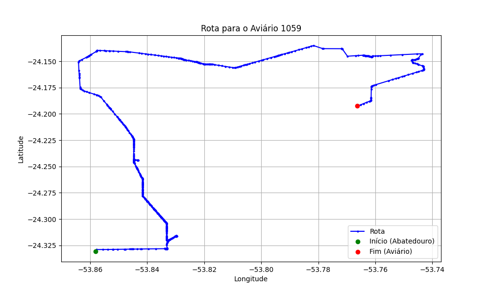

# Relatório de Rota - Aviário 1059

## Informações Gerais
- **Produtor:** MARCELO FUMAGALLI
- **Latitude:** -24.192722
- **Longitude:** -53.766083

## Dados da Rota
- **Distância Real:** 46.36 km
- **Tempo Estimado (OSRM):** 70.1 minutos
- **Tempo Estimado (40 km/h):** 69.5 minutos

## Mapa da Rota

[Visualizar Mapa Interativo](mapa_interativo.html)

## Rota até o aviário
1. Saia da rua sem nome, siga por 10m.
2. Vire à direita na Avenida Ariosvaldo Bitencourt, siga por 200m.
3. Siga em frente na Avenida Ariosvaldo Bitencourt, siga por 2,5 km.
4. Vire à esquerda na rua sem nome, siga por 1,5 km.
5. Vire levemente à esquerda na rua sem nome, siga por 660m.
6. Vire em frente na Rodovia Alberto Dalcanale, siga por 1,7 km.
7. New name em frente na Avenida Presidente Kennedy, siga por 7,2 km.
8. Fork levemente à direita na rua sem nome, siga por 12,1 km.
9. Vire à direita na Avenida Florianópolis, siga por 750m.
10. New name em frente na Estrada para Oroite, siga por 4,6 km.
11. End of road à esquerda na Estrada Estiva, siga por 3,7 km.
12. Vire à direita na rua sem nome, siga por 2,0 km.
13. Vire à esquerda na rua sem nome, siga por 2,8 km.
14. Vire acentuadamente à direita na Estrada da Balsa, siga por 860m.
15. Notification em frente na Balsa Palotina-Iporã, siga por 170m.
16. Notification em frente na rua sem nome, siga por 5,8 km.
17. Você chegará ao aviário 1059 à esquerda.
