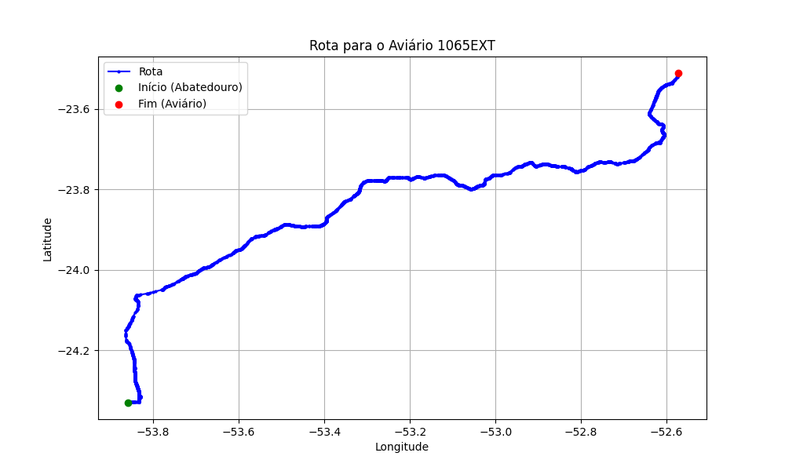

# Relatório de Rota - Aviário 1065EXT

## Informações Gerais
- **Produtor:** AVENORTE REGINALDO BUZZO 2
- **Latitude:** -23.510629
- **Longitude:** -52.573733

## Dados da Rota
- **Distância Real:** 206.01 km
- **Tempo Estimado (OSRM):** 172.4 minutos
- **Tempo Estimado (40 km/h):** 309.0 minutos

## Mapa da Rota

[Visualizar Mapa Interativo](mapa_interativo.html)

## Rota até o aviário
1. Saia da rua sem nome, siga por 10m.
2. Vire à direita na Avenida Ariosvaldo Bitencourt, siga por 200m.
3. Siga em frente na Avenida Ariosvaldo Bitencourt, siga por 2,5 km.
4. Vire à esquerda na rua sem nome, siga por 1,5 km.
5. Vire levemente à esquerda na rua sem nome, siga por 660m.
6. Vire em frente na Rodovia Alberto Dalcanale, siga por 1,7 km.
7. New name em frente na Avenida Presidente Kennedy, siga por 7,2 km.
8. Fork levemente à direita na rua sem nome, siga por 20,3 km.
9. Vire à direita na Avenida Brigadeiro Pamplona Pinto, siga por 1,1 km.
10. Siga em frente na rua sem nome, siga por 130m.
11. Siga em frente na rua sem nome, siga por 12,0 km.
12. Vire levemente à direita na rua sem nome, siga por 140m.
13. Siga em frente na rua sem nome, siga por 60m.
14. Siga em frente na rua sem nome, siga por 23,7 km.
15. Vire em frente na rua sem nome, siga por 55,7 km.
16. Rotary em frente na PR-323, siga por 60m.
17. Exit rotary em frente na PR-323, siga por 320m.
18. Siga em frente na rua sem nome, siga por 3,4 km.
19. Siga em frente na rua sem nome, siga por 110m.
20. Fork levemente à esquerda na rua sem nome, siga por 50m.
21. Siga em frente na rua sem nome, siga por 50,7 km.
22. Vire à esquerda na rua sem nome, siga por 50m.
23. New name em frente na Avenida Maranhão, siga por 3,0 km.
24. Rotary à direita na Avenida Maranhão, siga por 120m.
25. Exit rotary à direita na Avenida Maranhão, siga por 120m.
26. New name levemente à direita na Avenida Santa Catarina, siga por 850m.
27. Rotary à direita na Avenida Edson de Lima Souto, siga por 80m.
28. Exit rotary à direita na Avenida Edson de Lima Souto, siga por 860m.
29. Vire à direita na rua sem nome, siga por 10,5 km.
30. Fork levemente à direita na rua sem nome, siga por 5,4 km.
31. End of road à direita na rua sem nome, siga por 160m.
32. Vire à direita na Rua Voluntários da Pátria, siga por 3,2 km.
33. Vire à esquerda na rua sem nome, siga por 110m.
34. Vire à esquerda na rua sem nome, siga por 180m.
35. Você chegará ao aviário 1065EXT à esquerda.
