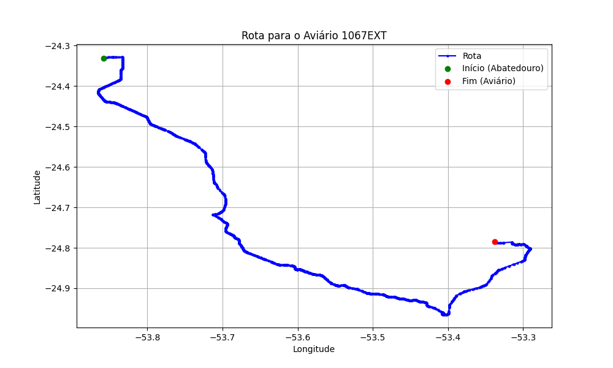

# Relatório de Rota - Aviário 1067EXT

## Informações Gerais
- **Produtor:** PLUMA MATHEUS HENRIQUE BRIXNER 2
- **Latitude:** -24.78475
- **Longitude:** -53.33892

## Dados da Rota
- **Distância Real:** 130.13 km
- **Tempo Estimado (OSRM):** 114.1 minutos
- **Tempo Estimado (40 km/h):** 195.2 minutos

## Mapa da Rota

[Visualizar Mapa Interativo](mapa_interativo.html)

## Rota até o aviário
1. Saia da rua sem nome, siga por 10m.
2. Vire à direita na Avenida Ariosvaldo Bitencourt, siga por 200m.
3. Siga em frente na Avenida Ariosvaldo Bitencourt, siga por 2,6 km.
4. Vire em frente na Rodovia Alberto Dalcanale, siga por 51,7 km.
5. Siga em frente na rua sem nome, siga por 230m.
6. Siga em frente na Rodovia Perimetral Norte, siga por 90m.
7. New name em frente na Rodovia José Neves Formighieri, siga por 45,5 km.
8. Siga em frente na rua sem nome, siga por 140m.
9. Off ramp levemente à esquerda na rua sem nome, siga por 310m.
10. Fork levemente à esquerda na rua sem nome, siga por 22,4 km.
11. Vire levemente à direita na rua sem nome, siga por 500m.
12. Vire à esquerda na Estrada para Santa Rosa, siga por 30m.
13. Roundabout à direita na Avenida Santa Catarina, siga por 60m.
14. Exit roundabout à direita na Avenida Santa Catarina, siga por 840m.
15. Rotary levemente à direita na Avenida Paraná, siga por 160m.
16. Exit rotary levemente à direita na Avenida Paraná, siga por 620m.
17. Vire à esquerda na Rua Girassol, siga por 360m.
18. Vire à direita na rua sem nome, siga por 520m.
19. End of road à direita na Rua Copo de Leite, siga por 90m.
20. Vire à esquerda na rua sem nome, siga por 1,3 km.
21. Vire à esquerda na rua sem nome, siga por 2,5 km.
22. Você chegará ao aviário 1067EXT à esquerda.
