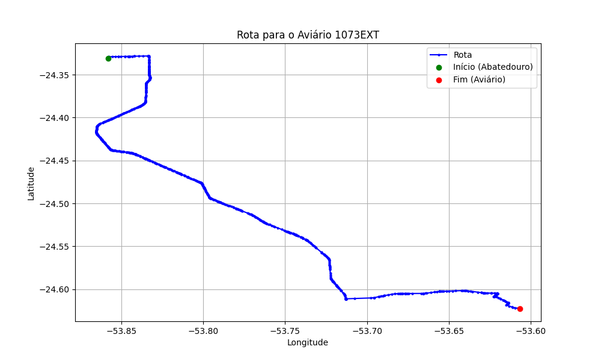

# Relatório de Rota - Aviário 1073EXT

## Informações Gerais
- **Produtor:** PLUMA JOAO CLAUDIO CANO 2
- **Latitude:** -24.623093
- **Longitude:** -53.606968

## Dados da Rota
- **Distância Real:** 54.42 km
- **Tempo Estimado (OSRM):** 53.6 minutos
- **Tempo Estimado (40 km/h):** 81.6 minutos

## Mapa da Rota

[Visualizar Mapa Interativo](mapa_interativo.html)

## Rota até o aviário
1. Saia da rua sem nome, siga por 10m.
2. Vire à direita na Avenida Ariosvaldo Bitencourt, siga por 200m.
3. Siga em frente na Avenida Ariosvaldo Bitencourt, siga por 2,6 km.
4. Vire em frente na Rodovia Alberto Dalcanale, siga por 38,7 km.
5. Vire levemente à esquerda na rua sem nome, siga por 130m.
6. Vire à esquerda na rua sem nome, siga por 9,5 km.
7. Vire levemente à direita na rua sem nome, siga por 50m.
8. Vire em frente na Rodovia Deputado Moacir Micheletto, siga por 480m.
9. Vire acentuadamente à esquerda na rua sem nome, siga por 140m.
10. Vire à direita na Rua Santo Antônio, siga por 1,6 km.
11. Vire à esquerda na rua sem nome, siga por 980m.
12. Você chegará ao aviário 1073EXT à direita.
