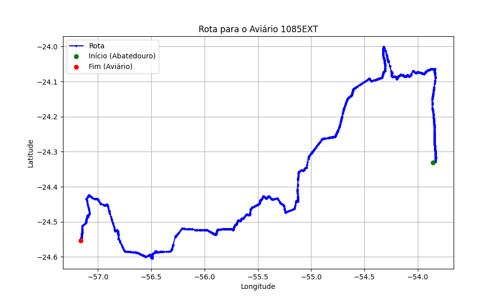

# Relatório de Rota - Aviário 1085EXT

## Informações Gerais
- **Produtor:** PLUMA VALDEMIR CHAGAS DE MATOS 04
- **Latitude:** -24.551417
- **Longitude:** -57.17956

## Dados da Rota
- **Distância Real:** 443.86 km
- **Tempo Estimado (OSRM):** 450.4 minutos
- **Tempo Estimado (40 km/h):** 665.8 minutos

## Mapa da Rota

[Visualizar Mapa Interativo](mapa_interativo.html)

## Rota até o aviário
1. Saia da rua sem nome, siga por 10m.
2. Vire à direita na Avenida Ariosvaldo Bitencourt, siga por 200m.
3. Siga em frente na Avenida Ariosvaldo Bitencourt, siga por 2,5 km.
4. Vire à esquerda na rua sem nome, siga por 1,5 km.
5. Vire levemente à esquerda na rua sem nome, siga por 660m.
6. Vire em frente na Rodovia Alberto Dalcanale, siga por 1,7 km.
7. New name em frente na Avenida Presidente Kennedy, siga por 7,2 km.
8. Fork levemente à direita na rua sem nome, siga por 20,3 km.
9. Vire à direita na Avenida Brigadeiro Pamplona Pinto, siga por 1,2 km.
10. Siga em frente na rua sem nome, siga por 130m.
11. Siga em frente na rua sem nome, siga por 37,7 km.
12. Vire à direita na rua sem nome, siga por 50m.
13. New name em frente na Avenida Roland, siga por 680m.
14. Roundabout em frente na Avenida Brasil, siga por 110m.
15. Exit roundabout em frente na Avenida Brasil, siga por 390m.
16. New name em frente na Avenida Martin Luther King, siga por 1,2 km.
17. Roundabout à direita na Avenida Martin Luther King, siga por 100m.
18. Exit roundabout à direita na Avenida Martin Luther King, siga por 330m.
19. Roundabout à direita na Avenida Martin Luther King, siga por 110m.
20. Exit roundabout à direita na Avenida Martin Luther King, siga por 1,7 km.
21. Roundabout à direita na Avenida Martin Luther King, siga por 30m.
22. Exit roundabout à direita na Avenida Martin Luther King, siga por 780m.
23. Rotary à direita na Avenida Almirante Tamandaré, siga por 90m.
24. Exit rotary à direita na Avenida Almirante Tamandaré, siga por 920m.
25. Roundabout em frente na rua sem nome, siga por 100m.
26. Exit roundabout em frente na rua sem nome, siga por 11,6 km.
27. Off ramp levemente à esquerda na rua sem nome, siga por 70m.
28. Siga em frente na rua sem nome, siga por 200m.
29. Fork levemente à direita na rua sem nome, siga por 640m.
30. New name em frente na Ruta Nacional General Aquino, siga por 5,8 km.
31. New name em frente na Avenida Paraguay, siga por 2,1 km.
32. Rotary à direita na Avenida Mariscal Francisco Solano Lopez Carrillo, siga por 20m.
33. Exit rotary à direita na Avenida Mariscal Francisco Solano Lopez Carrillo, siga por 242,2 km.
34. Rotary em frente na Ruta Nacional General Aquino, siga por 30m.
35. Exit rotary em frente na Ruta Nacional General Aquino, siga por 9,9 km.
36. Fork levemente à direita na rua sem nome, siga por 400m.
37. Roundabout em frente na Ruta Nacional 22, siga por 10m.
38. Exit roundabout levemente à direita na Ruta Nacional 22, siga por 35,4 km.
39. New name em frente na Circunvalación Ruta Nacional 22, siga por 3,8 km.
40. New name em frente na Ruta Nacional 22, siga por 8,2 km.
41. Vire em frente na Circunvalación Ruta Nacional 22, siga por 3,6 km.
42. New name em frente na Ruta Nacional 22, siga por 17,1 km.
43. New name em frente na Circunvalación Ruta Nacional 22, siga por 2,7 km.
44. Vire à esquerda na rua sem nome, siga por 5,4 km.
45. End of road à direita na rua sem nome, siga por 5,8 km.
46. Vire à direita na rua sem nome, siga por 3,8 km.
47. Vire à esquerda na rua sem nome, siga por 5,4 km.
48. Você chegará ao aviário 1085EXT.
