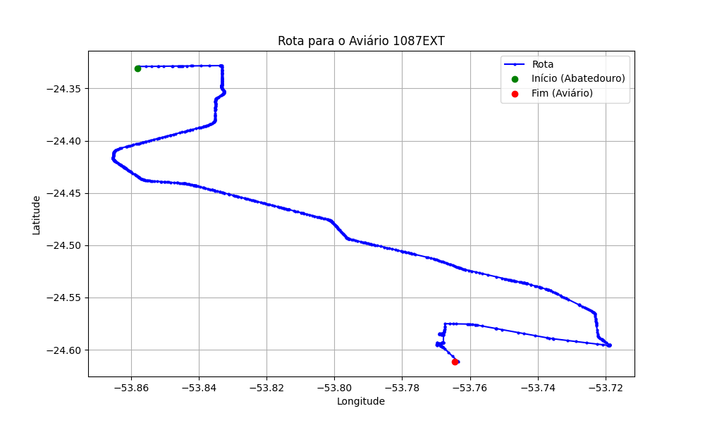

# Relatório de Rota - Aviário 1087EXT

## Informações Gerais
- **Produtor:** PLUMA NEIVA RAUBER SEIBERT
- **Latitude:** -24.611389
- **Longitude:** -53.764444

## Dados da Rota
- **Distância Real:** 49.97 km
- **Tempo Estimado (OSRM):** 49.7 minutos
- **Tempo Estimado (40 km/h):** 75.0 minutos

## Mapa da Rota

[Visualizar Mapa Interativo](mapa_interativo.html)

## Rota até o aviário
1. Saia da rua sem nome, siga por 10m.
2. Vire à direita na Avenida Ariosvaldo Bitencourt, siga por 200m.
3. Siga em frente na Avenida Ariosvaldo Bitencourt, siga por 2,6 km.
4. Vire em frente na Rodovia Alberto Dalcanale, siga por 37,0 km.
5. Vire acentuadamente à direita na rua sem nome, siga por 5,6 km.
6. Vire à esquerda na rua sem nome, siga por 2,6 km.
7. Vire à esquerda na OT -07, siga por 480m.
8. New name em frente na OT - 07, siga por 1,4 km.
9. Vire à direita na rua sem nome, siga por 100m.
10. Você chegará ao aviário 1087EXT.
