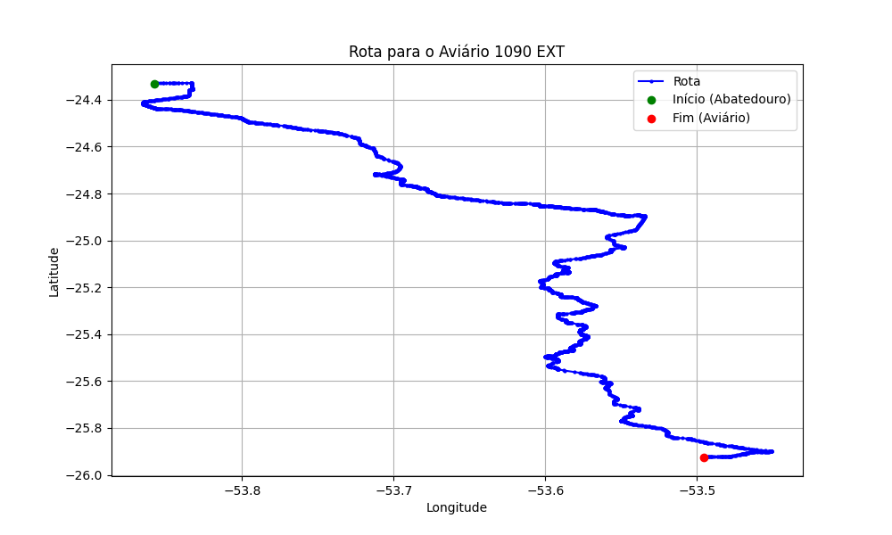

# Relatório de Rota - Aviário 1090 EXT

## Informações Gerais
- **Produtor:** BRF IZOLENE LURDES TOMAZINI 1
- **Latitude:** -25.925536
- **Longitude:** -53.495864

## Dados da Rota
- **Distância Real:** 216.74 km
- **Tempo Estimado (OSRM):** 192.0 minutos
- **Tempo Estimado (40 km/h):** 325.1 minutos

## Mapa da Rota

[Visualizar Mapa Interativo](mapa_interativo.html)

## Rota até o aviário
1. Saia da rua sem nome, siga por 10m.
2. Vire à direita na Avenida Ariosvaldo Bitencourt, siga por 200m.
3. Siga em frente na Avenida Ariosvaldo Bitencourt, siga por 2,6 km.
4. Vire em frente na Rodovia Alberto Dalcanale, siga por 51,7 km.
5. Siga em frente na rua sem nome, siga por 230m.
6. Siga em frente na Rodovia Perimetral Norte, siga por 90m.
7. New name em frente na Rodovia José Neves Formighieri, siga por 29,3 km.
8. Off ramp levemente à direita na rua sem nome, siga por 45,4 km.
9. Siga em frente na Avenida Souza Naves, siga por 3,1 km.
10. Vire em frente na Rodovia Deputado Arnaldo Faivro Busato, siga por 32,3 km.
11. Siga em frente na Rodovia Deputado Arnaldo Faivro Busato, siga por 8,4 km.
12. New name em frente na Rodovia Deputado Arnaldo Faiviro Busato, siga por 19,2 km.
13. Roundabout levemente à direita na rua sem nome, siga por 70m.
14. Exit roundabout em frente na rua sem nome, siga por 18,4 km.
15. Vire à direita na rua sem nome, siga por 60m.
16. Fork levemente à direita na Rodovia Dorival Gabriel Bandeira, siga por 2,2 km.
17. Roundabout em frente na Rua Quinze de Novembro, siga por 20m.
18. Exit roundabout levemente à direita na Rua Quinze de Novembro, siga por 1,8 km.
19. New name em frente na Avenida República Argentina, siga por 670m.
20. New name em frente na Rua Avenida República Argentina, siga por 1,1 km.
21. Você chegará ao aviário 1090 EXT à direita.
