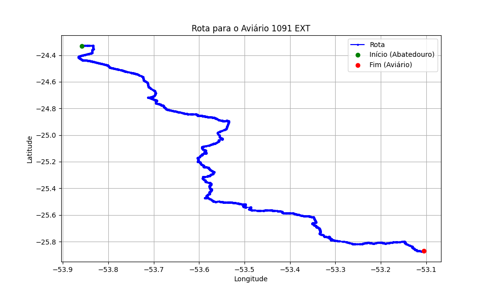

# Relatório de Rota - Aviário 1091 EXT

## Informações Gerais
- **Produtor:** BRF ETACIR MERGENER 1
- **Latitude:** -25.869907
- **Longitude:** -53.105177

## Dados da Rota
- **Distância Real:** 242.41 km
- **Tempo Estimado (OSRM):** 222.8 minutos
- **Tempo Estimado (40 km/h):** 363.6 minutos

## Mapa da Rota

[Visualizar Mapa Interativo](mapa_interativo.html)

## Rota até o aviário
1. Saia da rua sem nome, siga por 10m.
2. Vire à direita na Avenida Ariosvaldo Bitencourt, siga por 200m.
3. Siga em frente na Avenida Ariosvaldo Bitencourt, siga por 2,6 km.
4. Vire em frente na Rodovia Alberto Dalcanale, siga por 51,7 km.
5. Siga em frente na rua sem nome, siga por 230m.
6. Siga em frente na Rodovia Perimetral Norte, siga por 90m.
7. New name em frente na Rodovia José Neves Formighieri, siga por 29,3 km.
8. Off ramp levemente à direita na rua sem nome, siga por 45,4 km.
9. Siga em frente na Avenida Souza Naves, siga por 3,1 km.
10. Vire em frente na Rodovia Deputado Arnaldo Faivro Busato, siga por 23,3 km.
11. End of road acentuadamente à esquerda na Rodovia Deputado Arnaldo Faivro Busato, siga por 360m.
12. Vire levemente à direita na rua sem nome, siga por 7,6 km.
13. Vire à direita na rua sem nome, siga por 110m.
14. Fork levemente à direita na rua sem nome, siga por 60m.
15. New name em frente na rua sem nome, siga por 4,0 km.
16. Fork levemente à direita na rua sem nome, siga por 1,0 km.
17. Roundabout levemente à direita na rua sem nome, siga por 10m.
18. Exit roundabout levemente à direita na rua sem nome, siga por 30m.
19. New name levemente à direita na rua sem nome, siga por 1,1 km.
20. New name em frente na rua sem nome, siga por 330m.
21. New name em frente na rua sem nome, siga por 20,6 km.
22. Vire à direita na Avenida Iguaçu, siga por 4,3 km.
23. Vire em frente na Rodovia Cândido Rizzotto, siga por 15,4 km.
24. New name em frente na Avenida Nicolau Inácio, siga por 2,0 km.
25. Vire à esquerda na rua sem nome, siga por 19,5 km.
26. Roundabout em frente na rua sem nome, siga por 0m.
27. Exit roundabout em frente na rua sem nome, siga por 8,4 km.
28. Vire à esquerda na rua sem nome, siga por 1,2 km.
29. Vire à esquerda na rua sem nome, siga por 580m.
30. Você chegará ao aviário 1091 EXT à direita.
