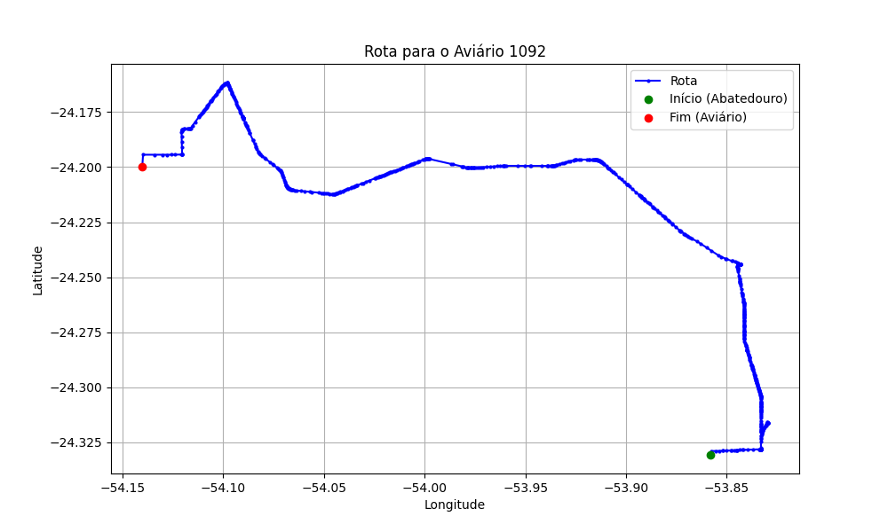

# Relatório de Rota - Aviário 1092

## Informações Gerais
- **Produtor:** ELAINE APARECIDA FACHINETTE DE PADUA
- **Latitude:** -24.1997
- **Longitude:** -54.140628

## Dados da Rota
- **Distância Real:** 52.12 km
- **Tempo Estimado (OSRM):** 59.1 minutos
- **Tempo Estimado (40 km/h):** 78.2 minutos

## Mapa da Rota

[Visualizar Mapa Interativo](mapa_interativo.html)

## Rota até o aviário
1. Saia da rua sem nome, siga por 10m.
2. Vire à direita na Avenida Ariosvaldo Bitencourt, siga por 200m.
3. Siga em frente na Avenida Ariosvaldo Bitencourt, siga por 2,5 km.
4. Vire à esquerda na rua sem nome, siga por 1,5 km.
5. Vire levemente à esquerda na rua sem nome, siga por 660m.
6. Vire em frente na Rodovia Alberto Dalcanale, siga por 1,7 km.
7. New name em frente na Avenida Presidente Kennedy, siga por 7,2 km.
8. Fork levemente à esquerda na rua sem nome, siga por 2,9 km.
9. New name em frente na rua sem nome, siga por 26,3 km.
10. Roundabout à direita na Avenida Presidente Castelo Branco, siga por 60m.
11. Exit roundabout levemente à direita na Avenida Presidente Castelo Branco, siga por 1,9 km.
12. Vire à esquerda na Avenida da Saudade, siga por 1,3 km.
13. New name em frente na Estrada Bela Vista, siga por 2,1 km.
14. Fork levemente à esquerda na Estrada Bela Vista, siga por 1,3 km.
15. Vire levemente à direita na Estrada Paraguaia, siga por 2,0 km.
16. Vire à esquerda na Estrada Duas Pontes, siga por 590m.
17. Você chegará ao aviário 1092 à direita.
