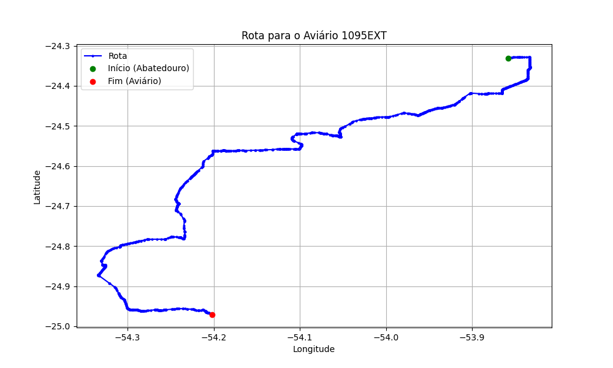

# Relatório de Rota - Aviário 1095EXT

## Informações Gerais
- **Produtor:** PLUMA ROBSON HAHN 01
- **Latitude:** -24.970812
- **Longitude:** -54.201808

## Dados da Rota
- **Distância Real:** 125.32 km
- **Tempo Estimado (OSRM):** 124.6 minutos
- **Tempo Estimado (40 km/h):** 188.0 minutos

## Mapa da Rota

[Visualizar Mapa Interativo](mapa_interativo.html)

## Rota até o aviário
1. Saia da rua sem nome, siga por 10m.
2. Vire à direita na Avenida Ariosvaldo Bitencourt, siga por 200m.
3. Siga em frente na Avenida Ariosvaldo Bitencourt, siga por 2,6 km.
4. Vire em frente na Rodovia Alberto Dalcanale, siga por 11,1 km.
5. Siga em frente na rua sem nome, siga por 60m.
6. Vire levemente à direita na rua sem nome, siga por 2,0 km.
7. Vire em frente na rua sem nome, siga por 1,8 km.
8. Vire em frente na rua sem nome, siga por 10,9 km.
9. Vire em frente na rua sem nome, siga por 11,5 km.
10. Roundabout à direita na rua sem nome, siga por 10m.
11. Exit roundabout levemente à direita na rua sem nome, siga por 300m.
12. Siga em frente na rua sem nome, siga por 4,8 km.
13. Off ramp levemente à direita na rua sem nome, siga por 230m.
14. New name em frente na Contorno de Marechal Cândido Rondon, siga por 270m.
15. Siga em frente na Contorno de Marechal Cândido Rondon, siga por 40m.
16. Siga em frente na Contorno de Marechal Cândido Rondon, siga por 4,6 km.
17. Vire em frente na rua sem nome, siga por 300m.
18. Vire em frente na rua sem nome, siga por 10,1 km.
19. New name em frente na rua sem nome, siga por 25,7 km.
20. Roundabout levemente à direita na Avenida Principal, siga por 0m.
21. Exit roundabout levemente à direita na Avenida Principal, siga por 580m.
22. New name em frente na Rodovia Doutor Ivo Rocha, siga por 27,4 km.
23. Vire em frente na rua sem nome, siga por 4,5 km.
24. Vire à esquerda na Estrada para São Miguelzinho, siga por 4,9 km.
25. Siga em frente na Estrada para São Miguelzinho, siga por 1,4 km.
26. Você chegará ao aviário 1095EXT à esquerda.
