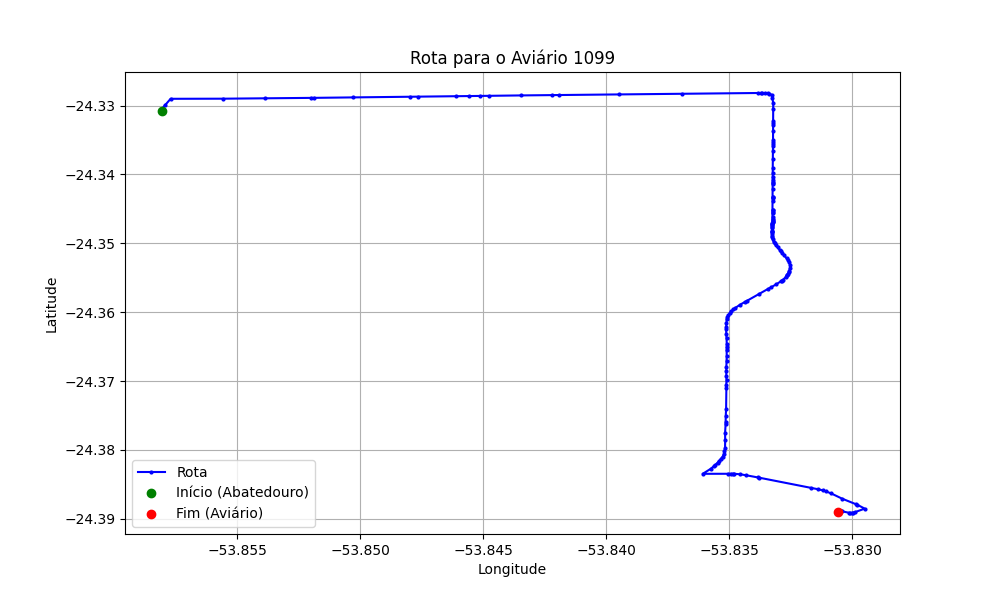

# Relatório de Rota - Aviário 1099

## Informações Gerais
- **Produtor:** WILFRID FRITZKE
- **Latitude:** -24.388719
- **Longitude:** -53.831214

## Dados da Rota
- **Distância Real:** 9.95 km
- **Tempo Estimado (OSRM):** 12.1 minutos
- **Tempo Estimado (40 km/h):** 14.9 minutos

## Mapa da Rota

[Visualizar Mapa Interativo](mapa_interativo.html)

## Rota até o aviário
1. Saia da rua sem nome, siga por 10m.
2. Vire à direita na Avenida Ariosvaldo Bitencourt, siga por 200m.
3. Siga em frente na Avenida Ariosvaldo Bitencourt, siga por 2,6 km.
4. Vire em frente na Rodovia Alberto Dalcanale, siga por 6,0 km.
5. Vire à esquerda na rua sem nome, siga por 930m.
6. Vire à direita na rua sem nome, siga por 160m.
7. Você chegará ao aviário 1099 à direita.
